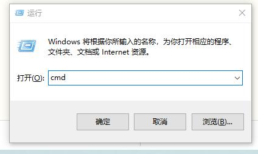
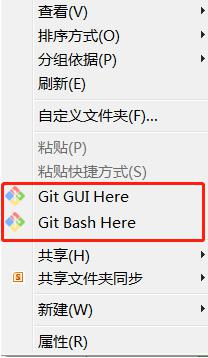
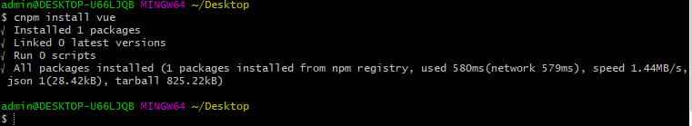
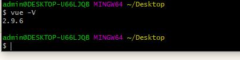

# vue.js的安装
## 1、直接将vue.js下载到本地，并通过```<script>```标签引入
1. 在[vue官网](https://cn.vuejs.org/v2/guide/installation.html#%E7%9B%B4%E6%8E%A5%E7%94%A8-lt-script-gt-%E5%BC%95%E5%85%A5)下载vue.js
2. 将下载的文件放在项目中
3. 在页面引入
[例子](../demo01/new_file.html)

 
 

## 2、使用cdn引入线上版本
* 相比与第一步，我们不用将vue.js下载到本地，而是通过cdn链接直接引入线上包

对于制作原型或学习，你可以这样使用最新版本：
``` 
<script src="https://cdn.jsdelivr.net/npm/vue/dist/vue.js"></script>
```
对于生产环境，我们推荐链接到一个明确的版本号和构建文件，以避免新版本造成的不可预期的破坏：
``` 
<script src="https://cdn.jsdelivr.net/npm/vue@2.6.11"></script>
```
## 3、npm 脚手架方法
### 第一步、安装node
* vue的运行是要依赖于node的npm的管理工具来实现,所以在搭建vue的开发环境前，我们现安装node。
  * 网址1：[http://nodejs.cn/download/](http://nodejs.cn/download/)
  * 网址2：[https://nodejs.org/zh-cn/](https://nodejs.org/zh-cn/)
* 检验node是否安装成功
   1. Win+R 打开cmd窗口，输入cmd,回车
   2. 在新打开的窗口中输入node -v,回车
   3. 如图所示，如果返回版本号，说明node安装成功

### 第二步、安装git
* git官网:[https://git-scm.com/download](https://git-scm.com/download)
* 安装好之后回到桌面右键单击
* 打开git Bash Here,输入git回车
* 以后在这个窗口操作命令行，或者也可以跳过安装git，在cmd窗口操作命令行

### 第三步、安装淘宝镜像
* 因为npm下载速度比较慢，所以我们用cnpm淘宝镜像来下载包
```
npm install -g cnpm --registry=https://registry.npm.taobao.org
```
  
  
### 第四步、安装vue
```
cnpm install vue 
```


### 第五步、安装全局vue-cli脚手架
```
cnpm install --global vue-cli
```

### 第六步、检查vue是否安装成功
```
vue -V
```


### 第七步、创建一个基于webpack模板的新项目
* 在桌面新建一个文件夹demo03,然后在这个文件夹内鼠标右键重新打开git Bash Here，注意此时的路径已经切换到demo03下，我们在这个目录下创建一个my-vue的项目：
```
vue init webpack my-vue
```
一路回车，然后等待项目创建成功


### 第八步、启动项目，访问项目
* 进入项目
```
cd my-vue
```
* 启动项目
```
cnpm run dev
```

*此时在浏览器输入[http://localhost:8080/](http://localhost:8080/)，就可以看到vue项目已经搭建成功


