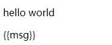

## vue指令

* [1.v-html](#1)
* [2.v-once](#2)
* [3.v-text](#3)
* [4.v-pre](#4)
* [5.v-clock](#5)
* [6.v-slot](#6)
* [7.v-model](#7)

* [8.v-if](#8)
* [9.v-show](#9)
* [10.v-for](#10)
* [11.v-bind](#11)
* [12.v-on](#12)

 
<h1 id='1'>1.v-html</h1>

[代码示例](https://github.com/yuan525/vue-notes/blob/master/day02.vue%E6%8C%87%E4%BB%A4/instruction/v-html.html)
- 数据绑定最常见的形式就是使用“Mustache”语法 (双大括号) 的文本插值.双大括号会将数据解释为普通文本，而非 HTML 代码,如果想输出真正的html,就用到v-html
 - 用法:
```
<p>{{html}}</p>
<p v-html="html"></p>
<p v-html="html">{{html}}</p>
<!-- html:"<span style='color:red'>I'm red</span>" -->
```
 - 效果:
 
- **你的站点上动态渲染的任意 HTML 可能会非常危险，因为它很容易导致 XSS 攻击。请只对可信内容使用 HTML 插值，绝不要对用户提供的内容使用插值。**

<h1 id='2'>2.v-once</h1>

[代码示例](https://github.com/yuan525/vue-notes/blob/master/day02.vue%E6%8C%87%E4%BB%A4/instruction/v-once.html)
* 只渲染元素和组件一次。随后的重新渲染，元素/组件及其所有的子节点将被视为静态内容并跳过。这可以用于优化更新性能
 * 用法:

```
 <p>{{a}}</p>
 <p v-once>{{a}}</p>
 <button v-on:click="click">点击</button>
 
 <!-- 
 a:'aaaaa',
 click事件改变a的值
 -->
```
 * 效果:

 
 
 
<h1 id='3'>3.v-text</h1>

[代码示例](https://github.com/yuan525/vue-notes/blob/master/day02.vue%E6%8C%87%E4%BB%A4/instruction/v-text.html)
* 更新元素的 textContent,和{{Mustache}}效果一样,但是会覆盖标签内的文本
* 因为没有{{}}表达式,所以不会有闪烁问题
 * 用法:
```
<p>{{msg}}!!!!!!</p>
<p v-text="msg">!!!!</p>
<p v-text="msg"></p>
<span v-text="msg"/>
<!-- msg:'hello world' -->
```

 * 效果:

  
  
<h1 id='4'>4.v-pre</h1>

[代码示例](https://github.com/yuan525/vue-notes/blob/master/day02.vue%E6%8C%87%E4%BB%A4/instruction/v-pre.html)
* 跳过这个元素和它的子元素的编译过程。可以用来显示原始 Mustache 标签。跳过大量没有指令的节点会加快编译。
  * 用法:
  ```
  <p>{{msg}}</p>
  <p v-pre>{{msg}}</p>
  <!-- msg:'hello world' -->
  ```
  
  * 效果:
  
  
  
<h1 id='5'>5.v-clock</h1>

[代码示例](https://github.com/yuan525/vue-notes/blob/master/day02.vue%E6%8C%87%E4%BB%A4/instruction/v-clock.html)
> 这个指令保持在元素上直到关联实例结束编译。和 CSS 规则如 [v-cloak] { display: none } 一起用时，这个指令可以隐藏未编译的 Mustache 标签直到实例准备完毕。

* 这段话什么意思呢,简单来说吧.我们知道渲染普通文本有两种方式:{{}}和v-text,如果我们用{{msg}}来渲染文本'hello',在网络速度比较慢的时候,用户会先看到  **{{msg}}**  ,再看到  **hello**  ,即所谓的闪烁问题,而v-clock指令配合CSS 规则如 [v-cloak] { display: none } 一起用时,就是来解决这种问题的
 * 用法:
```
<style type="text/css">
 	[v-cloak] {
 	  display: none;
 	}
</style>
```
 ```
 <div id="app">
 	<p v-cloak>{{msg}}</p>
 </div>
 <!-- msg:'hello world' -->
 ```

<h1 id='6'>6.v-slot</h1>

[详情见组件相关笔记]()

<h1 id='7'>7.v-model</h1>

[代码示例](https://github.com/yuan525/vue-notes/blob/master/day02.vue%E6%8C%87%E4%BB%A4/instruction/v-model.html)
* 表单输入绑定,可以在表单元素上创建双向的数据绑定

 - input输入框
```
<input v-model="message">
```

 - 单选框
```
<input type="radio" id="boy" value="男" v-model="sex">
<label for="boy">男</label>					
<input type="radio" id="girl" value="女" v-model="sex">
<label for="girl">女</label>
```

 - 多选框
```
<input type="checkbox" id="music" value="音乐" v-model="hobby">
<label for="music">音乐</label>
<input type="checkbox" id="art" value="美术" v-model="hobby">
<label for="art">美术</label>
<input type="checkbox" id="game" value="游戏" v-model="hobby">
<label for="game">游戏</label>
```

 - 下拉框
```
<select v-model="selected">
       <option disabled value="">请选择</option>
       <option>A</option>
       <option>B</option>
       <option>C</option>
    </select>
```

 - 多行文本框
```
<textarea v-model="msg" ></textarea>
```

* 修饰符
 - .lazy:
 在默认情况下，v-model 在每次 input 事件触发后将输入框的值与数据进行同步 。你可以添加 lazy 修饰符，从而转为在 change 事件_之后_进行同步.此修饰符只对input和textarea有效
```
<input v-model.lazy="message">
<textarea v-model.lazy="msg" ></textarea>
```

 - .number:
如果想自动将用户的输入值转为数值类型，可以给 v-model 添加 number 修饰符.这通常很有用，因为即使在 type="number" 时，HTML 输入元素的值也总会返回字符串。如果这个值无法被 parseFloat() 解析，则会返回原始的值
```
<input v-model.number="message">
```

 - .trim
如果要自动过滤用户输入的首尾空白字符，可以给 v-model 添加 trim 修饰符
```
<input v-model.trim="message">
```

<h1 id='8'>8.v-if</h1>

[代码示例](https://github.com/yuan525/vue-notes/blob/master/day02.vue%E6%8C%87%E4%BB%A4/instruction/v-if.html)
* v-if 指令用于条件性地渲染一块内容。这块内容只会在指令的表达式返回 true 值的时候被渲染。
```	
<p v-if="boolen">当boolen为true时这里显示,当boolen为false时这里隐藏</p>
```
* 你可以使用 v-else 指令来表示 v-if 的“else 块”：
```	
<p v-if="num>3">当num值大于3是这块显示</p>
<p v-else>当上面v-if中的条件不成立时这里显示</p>
```
* v-else-if，顾名思义，充当 v-if 的“else-if 块”，可以连续使用：
```
<p v-if="type=='a'">1</p>
<p v-else-if="type=='b'">2</p>
<p v-else-if="type=='c'">3</p>
<p v-else>{{type}}</p>
```
* 用key管理可复用的元素

Vue 会尽可能高效地渲染元素，通常会复用已有元素而不是从头开始渲染,那么就会出现下面这个问题
```
<p v-if='bol'>
	1<input placeholder="这是第一个输入框" />
</p>
<p v-else>
	2<input placeholder="这是第二个" />
</p>
<button v-on:click="click">点击</button>
```
这个代码块中的两个input其实是一个,点击click事件切换的显示隐藏这两个input,你会发现输入的value值没有变化,那怎么达到我们想要的效果呢,即这两个元素是完全独立的，不要复用它们,只需要给这两个元素添加一个唯一的key值即可
```
<p v-if='bol'>
	1<input placeholder="这是第一个输入框" key='a'/>
</p>
<p v-else>
	2<input placeholder="这是第二个"  key='b'/>
</p>
<button v-on:click="click">点击</button>
```

<h1 id='9'>9.v-show</h1>

[代码示例](https://github.com/yuan525/vue-notes/blob/master/day02.vue%E6%8C%87%E4%BB%A4/instruction/v-show.html)
* 根据表达式之真假值，切换元素的显示隐藏,和v-if不同的是,v-show影藏时是在元素的style中加上display:none,元素本身还存在于DOM中,
```
<p v-show="bol"></p>
```

> 注意，v-show 不支持 ```<template>``` 元素，也不支持 v-else

> v-if 是“真正”的条件渲染，因为它会确保在切换过程中条件块内的事件监听器和子组件适当地被销毁和重建。

> v-if 也是惰性的：如果在初始渲染时条件为假，则什么也不做——直到条件第一次变为真时，才会开始渲染条件块。

> 相比之下，v-show 就简单得多——不管初始条件是什么，元素总是会被渲染，并且只是简单地基于 CSS 进行切换。

> 一般来说，v-if 有更高的切换开销，而 v-show 有更高的初始渲染开销。因此，如果需要非常频繁地切换，则使用 v-show 较好；如果在运行时条件很少改变，则使用 v-if 较好。

<h1 id='10'>10.v-for</h1>

[代码示例](https://github.com/yuan525/vue-notes/blob/master/day02.vue%E6%8C%87%E4%BB%A4/instruction/v-for.html)
> 我们可以用 v-for 指令基于一个数组来渲染一个列表。v-for 指令需要使用 item in items 形式的特殊语法，其中 items 是源数据数组，而 item 则是被迭代的数组元素的别名。

* 遍历一个数组
```
<p v-for="item in arr">{{item}}</p>
<!-- arr:['a','b','c','d'] -->
```
 
 * 你也可以用 of 替代 in 作为分隔符，因为它更接近 JavaScript 迭代器的语法：
```
<p v-for="item of arr">{{item}}</p>
```
 
 * v-for 还支持一个可选的第二个参数，即当前项的索引
```
<p v-for="(item,index) in arr">下标:{{index}},值:{{item}}</p>
```

* 遍历一个对象
```
<p v-for="item in obj">{{item}}</p>
<!-- obj:{
		name:'tom',
		sex:'男',
		age:18
		} -->
```

 * 遍历对象时可以用第二个参数当做对象的健名
```
<p v-for="(item,name) in obj">建:{{name}}----值:{{item}}</p>
```

 * 还可以用第三个参数当做对象的索引
```
<p v-for="(item,name,index) in obj">索引:{{index}}----建:{{name}}----值:{{item}}</p>
```

> 在遍历对象时，会按 Object.keys() 的结果遍历，但是不能保证它的结果在不同的 JavaScript 引擎下都一致。

* v-for 也可以接受整数。在这种情况下，它会把模板重复对应次数。
```
<p v-for="num in 4">{{num}}</p>
```

<h1 id='11'>11.v-bind</h1>

[代码示例](https://github.com/yuan525/vue-notes/blob/master/day02.vue%E6%8C%87%E4%BB%A4/instruction/v-bind.html)
> 动态地绑定一个或多个 attribute，或一个组件 prop 到表达式。在绑定 class 或 style attribute 时，支持其它类型的值，如数组或对象

* 绑定一个属性
```

```

* 也可以动态的绑定
```

```

* v-bind可以缩写为:
```


```

* class绑定
  * 我们可以传给 v-bind:class 一个对象，以动态地切换 class
  ```
  <div v-bind:class="{ active: isActive }"></div>
  ```
  
  上面的语法表示 active 这个 class 存在与否将取决于数据 property isActive 的真假值
  
  * v-bind:class 指令也可以与普通的 class 属性共存
  ```
  <div v-bind:class="{ active: isActive }" class='static'></div>
  ```
  
  * 绑定的数据对象不必内联定义在模板里
  ```
  <div v-bind:class="classObject"></div>
  ```
  ```
  data: {
    classObject: {
      active: true,
    }
  }
  ```
  
  * 我们可以把一个数组传给 v-bind:class，以应用一个 class 列表
  ```
  <div :class="[classA, classB]"></div>
  ```
  ```
  data: {
    classA:'classA',
    classB:"classB"
  }
  ```
  
  * 我们也可以把数组语法和对象语法组合使用,已达到更灵活的控制效果
  ```
  <div :class="[classA, { classB: isB, classC: isC }]">
  ```
  
* style绑定
 * v-bind:style 的对象语法十分直观——看着非常像 CSS，但其实是一个 JavaScript 对象。CSS property 名可以用驼峰式 (camelCase) 或短横线分隔 (kebab-case，记得用引号括起来) 来命名：
 ```
 <p v-bind:style="{ color: activeColor, fontSize: fontSize + 'px' }"></p>
 ```
 ```
 data: {
   activeColor: 'red',
   fontSize: 30
 }
 ```
 
 * 直接绑定到一个样式对象通常更好，这会让模板更清晰：
 ```
 <p v-bind:style="styleObject"></p>
 ```
 ```
 styleObject: {
     color: 'red',
     fontSize: '13px'
   }
 ```
 
 * v-bind:style 的数组语法可以将多个样式对象应用到同一个元素上：
 ```
 <p v-bind:style="[styleObject,baseStyles]"></p>
 ```
 ```
 styleObject: {
     color: 'red',
     fontSize: '13px'
   },
   baseStyles:{
 	  width: "100px",
 	  height: "100px",
 	  backgroundColor: "rgba(0,0,0,0.5)"
   }
 ```
 
<h1 id='12'>12.v-on</h1>

[代码示例](https://github.com/yuan525/vue-notes/blob/master/day02.vue%E6%8C%87%E4%BB%A4/instruction/v-on.html)
> 绑定事件监听器。事件类型由参数指定。表达式可以是一个方法的名字或一个内联语句，如果没有修饰符也可以省略。

* 可以用 v-on 指令监听 DOM 事件，并在触发时运行一些 JavaScript 代码。
```
<p>content:{{content}}</p>
<button v-on:click="content += 1">add+1</button>
```

* v-on:的缩写为@,所以上面的代码也可以写成
```
<p>content:{{content}}</p>
<button @click="content += 1">add+1</button>
```

* 实际开发中,事件处理逻辑更加复杂,所以v-on 还可以接收一个需要调用的方法名称。
```
<button v-on:click="click">点击事件</button>
```

 -  在 `methods` 对象中定义方法
 ```
 methods:{
 	click(){
 	   alert('Hello world')	
 	}
 }
 ```
* 可以动态的绑定事件
```
<button v-on:[event]='click'>动态事件</button>
```

* 事件传参
```
<button v-on:click="click2('tom')">传参</button>
```
```
click2(e){
	alert('hello '+ e)
}
```

* v-on修饰符

 - .stop - 调用 event.stopPropagation()。
 - .prevent - 调用 event.preventDefault()。
 - .capture - 添加事件侦听器时使用 capture 模式。
 - .self - 只当事件是从侦听器绑定的元素本身触发时才触发回调。
 - .{keyCode | keyAlias} - 只当事件是从特定键触发时才触发回调。
 - .native - 监听组件根元素的原生事件。
 - .once - 只触发一次回调。
 - .left - (2.2.0) 只当点击鼠标左键时触发。
 - .right - (2.2.0) 只当点击鼠标右键时触发。
 - .middle - (2.2.0) 只当点击鼠标中键时触发。
 - .passive - (2.3.0) 以 { passive: true } 模式添加侦听器